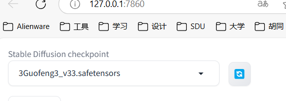

# 搭建自己的 AI 作图工具(记录)

基于一些开源的库来搭建一套自己的 AI 作图工具。

需要使用的开源库为 Stable Diffusion web UI，它是基于 Gradio 库的 Stable Diffusion 浏览器界面

Stable Diffusion web UI GitHub 地址：https://github.com/AUTOMATIC1111/stable-diffusion-webui

<font color = "red">运行 Stable Diffusion 需要硬件要求比较高，运行时会消耗较大的资源，特别是显卡。</font>>

### Windows 环境安装

本地环境要求安装 Python 3.10.6 或以上版本，并把它加入到本机的环境变量中。

下载 Stable Diffusion web UI GitHub 源码 https://github.com/AUTOMATIC1111/stable-diffusion-webui。

```
git clone https://github.com/AUTOMATIC1111/stable-diffusion-webui.git
```

需要下载模型，下载地址：https://huggingface.co/CompVis/stable-diffusion-v-1-4-original


将下载的模型移动到 **stable-diffusion-webui/models/Stable-diffusion** 目录下。

Windows 使用非管理员运行:

```
webui-user.bat
```

接下来程序就会自动安装并启动，启动成功会看到一个可访问的 URL 地址 **http://127.0.0.1:7860**：


访问 **http://127.0.0.1:7860**，界面如下：


### Civitai 介绍

Civitai 有许多定制好的模型，而且可以免费下载，我们使用**国风3**模型来测试，下载地址：https://civitai.com/models/10415/3-guofeng3?modelVersionId=36644

下载完后，我们将模型移动到 **stable-diffusion-webui/models/Stable-diffusion** 目录下，重新启动 stable-diffusion-webui ：

```
./webui.sh
```

这样我们就可以在模型列表中选择**国风3**模型了：



## 输入提示词

生成画

>
>
>身穿中国唐朝汉服的女生，油画风格，樱花，春天，温柔氛围，细腻皮肤，高质量，精美细节


